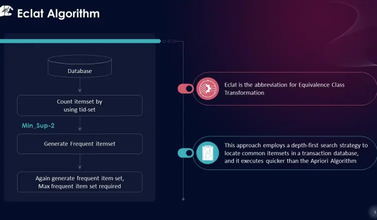
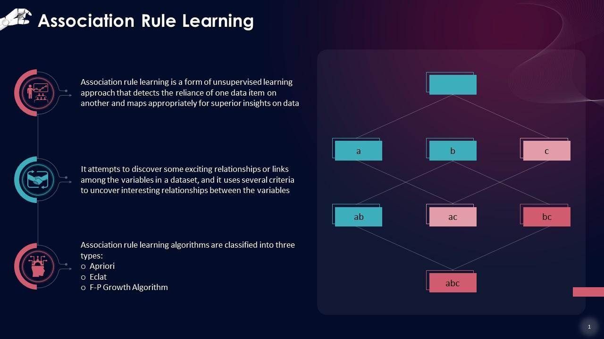

# MarketMaster - Smart Basket Analysis using Eclat Model


## Developer Information
**Name:** Yuvraj Singh Chowdhary  
**LinkedIn:** [Connect with me on LinkedIn](https://www.linkedin.com/in/yuvraj-singh-chowdhary/)  
**Reddit:** [Connect with me on Reddit](https://www.reddit.com/user/SuccessfulStrain9533/)  
**GitHub Repo:** [MarketMaster - Smart Basket Analysis Eclat](https://github.com/chowdhary19/MarketMaster---Smart-Basket-Analysis-Eclat.git)

## Objective
I was given the task of finding the association rule between products to identify pairs of items that frequently appear together in transactions. This information could be used to optimize marketing strategies such as buy one get one free deals.

## Overview
In this project, I used the Eclat algorithm for association rule learning to analyze a dataset containing 7500 transactions. The goal was to discover interesting relationships between products in the dataset.

## Dataset
The dataset used in this project is `Market_Basket_Optimisation.csv`, which consists of 7500 transactions. Each row represents a transaction, and each column represents a product purchased in that transaction.

## Libraries Used
The following Python libraries were used in this project:
- `numpy`: For numerical operations.
- `pandas`: For data manipulation and analysis.
- `matplotlib`: For data visualization.
- `apyori`: For implementing the Eclat algorithm.

### Installation
To install the necessary libraries, run the following command:
```bash
pip install numpy pandas matplotlib apyori
```

## Data Preprocessing
The dataset did not contain column names, so data preprocessing was performed to transform the data into a suitable format for the Eclat algorithm. Each transaction was converted into a list of items.

```python
import numpy as np
import pandas as pd
import matplotlib.pyplot as plt

# Load the dataset
dataset = pd.read_csv('Market_Basket_Optimisation.csv', header=None)

# Data Preprocessing
transactions = []
for i in range(0, 7501):
    transactions.append([str(dataset.values[i, j]) for j in range(0, 20)])
```

## Eclat Algorithm
The Eclat algorithm was applied to the preprocessed data to find the association rules.

```python
from apyori import apriori

# Applying Eclat algorithm
rules = apriori(transactions=transactions, min_support=0.003, min_confidence=0.2, min_lift=3, min_length=2, max_length=2)

# Converting results to a list
results = list(rules)
```

## Inspecting the Results
A function was created to inspect the results and convert them into a pandas DataFrame for better visualization and analysis.

```python
def inspect(results):
    lhs = [tuple(result[2][0][0])[0] for result in results]
    rhs = [tuple(result[2][0][1])[0] for result in results]
    supports = [result[1] for result in results]
    return list(zip(lhs, rhs, supports))

resultsinDataFrame = pd.DataFrame(inspect(results), columns=['Product Bought', 'Product Likely To Buy', 'Support'])

# Displaying top 10 results with highest lift
top_results = resultsinDataFrame.nlargest(n=10, columns='Support')
print(top_results)
```



## Key Findings
From the analysis, one of the key associations discovered was that customers who bought herb & pepper were also likely to buy ground beef. This insight could be used to design a buy one get one free deal to boost sales of these products.

## Instructions for Collaborators and Users
1. **Modify Data Preprocessing:** Adapt the data preprocessing phase to fit your business dataset. Ensure that each transaction is represented as a list of items.
2. **Adjust Eclat Parameters:** Depending on your business requirements, you might need to adjust the `min_support`, `min_confidence`, and other parameters of the Eclat algorithm to suit your specific needs.
3. **Analyze Results:** Use the provided code to inspect the results and identify interesting associations between products.

### Example Adjustments
- **min_support:** Increase or decrease the value to control the frequency of the itemsets considered.
- **min_confidence:** Adjust this value to ensure the rules have the desired level of certainty.
- **Data Preprocessing:** If your dataset has different structures, modify the preprocessing code to correctly format your transactions.



## Conclusion
This project demonstrates how to use the Eclat algorithm for market basket analysis. By identifying associations between products, businesses can make informed decisions to enhance their marketing strategies.

## The Dataset and Full Source Code
The dataset and the full source code have been deployed in the GitHub repository. Looking forward to positive collaborations.


